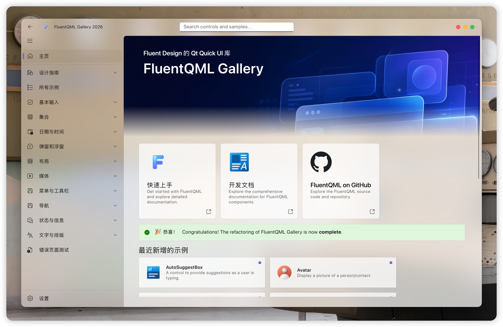

<div align="center">

<h1>FluentQML</h1>
<p>Fluent Design components for PySide6 and Qt Quick.</p>

[](https://pypi.org/project/fluentqml/)
[](https://pypi.org/project/fluentqml/)
[](./LICENSE)
[](#installation)

**English** | [中文](./docs/README_zhCN.MD)

</div>

> [!IMPORTANT]
> FluentQML is a secondary development based on
> [RinUI](https://github.com/RinLit-233-shiroko/Rin-UI)
> RinUI is licensed under the MIT License, and the
> original copyright notice is preserved in this repository's license file.



## Overview

FluentQML is a PySide6 + QML component library for building desktop interfaces
with a Fluent Design inspired look and feel. It provides reusable Qt Quick
controls, window chrome, theme handling, icon support, translation loading, and
a gallery app that demonstrates the available components.

The project is designed for developers who want to keep their application UI in
QML while using Python for application startup, window management,
configuration, and platform integration.

## Compared with RinUI

FluentQML currently adds these changes:

- macOS native window materials: System, HUD, and None.
- Better macOS window handling, including native title-bar integration and smoother window dragging.
- Windows 11 Snap Layout support for custom windows.
- Acrylic label material demo and TableView component support.
- QML, fonts, images, and translations compiled into Qt qrc resources for PyPI packages.
- Cross-platform Python scripts for resource building, Gallery packaging, and releases.
- Fixes for CalendarDatePicker, Expander rounded corners, page refresh behavior, and config paths.

## Installation

Install from PyPI after the package is published:

```bash
pip install fluentqml
```

For local development, install this repository in editable mode:

```bash
git clone https://github.com/Cheukfung/fluentqml.git
cd fluentqml
uv sync
```

If you are not using `uv`, install the runtime dependencies manually:

```bash
pip install PySide6 darkdetect
```

## Quick Start

Create a QML file, for example `main.qml`:

```qml
import QtQuick
import FluentQML

FluentWindow {
    visible: true
    width: 900
    height: 600
    title: "FluentQML App"

    Text {
        anchors.centerIn: parent
        text: "Hello FluentQML"
    }
}
```

Launch it from Python:

```python
import sys

from PySide6.QtWidgets import QApplication
from fluentqml import FluentQMLWindow

app = QApplication(sys.argv)
window = FluentQMLWindow("main.qml")
sys.exit(app.exec())
```

The QML import name is `FluentQML`; the Python package name is `fluentqml`.

## Gallery

Run the gallery app from the repository root:

```bash
uv run python examples/gallery.py
```

Or, if you are managing dependencies yourself:

```bash
python examples/gallery.py
```

The gallery is the best place to inspect available controls and copy working
usage patterns while the formal documentation is still being written.

## Project Layout

```text
fluentqml/              Core Python package, QML modules, resources, hooks
examples/               Gallery app and component usage examples
docs/                   Images and documentation drafts
scripts/                Resource and release helper scripts
test/                   Small local QML loading experiments
```

## Development

Regenerate the Qt resource bundle after changing QML, fonts, images, or
translation files:

```bash
uv run python scripts/build_fluentqml_qrc.py
```

Run lint checks:

```bash
uv run ruff check .
```

Update library translations:

```bash
uv run python scripts/update_ts.py library
```

Update Gallery translations:

```bash
uv run python scripts/update_ts.py gallery
```

Package the Gallery app with PyInstaller:

```bash
uv run python scripts/package_gallery.py
```

Build release artifacts:

```bash
uv run python scripts/release.py build
```

The release script cleans `dist/`, regenerates `fluentqml_rc.py`, builds the
sdist and wheel, verifies that the wheel contains `fluentqml/fluentqml_rc.py`,
checks that raw QML resources are not accidentally included in the wheel, and
runs `twine check`.

Upload the already-built artifacts to TestPyPI:

```bash
uv run python scripts/release.py upload-testpypi
```

Upload the same artifacts to PyPI after testing the TestPyPI install:

```bash
uv run python scripts/release.py upload-pypi
```

Useful naming conventions in this project:

- Python import: `from fluentqml import FluentQMLWindow`
- QML import: `import FluentQML`
- Qt resource prefix: `qrc:/FluentQML`
- Generated resource module: `fluentqml.fluentqml_rc`

## Credits

FluentQML uses resources and ideas from the wider Qt and Fluent ecosystem:

- [PySide6 and Qt Quick](https://www.qt.io/)
- [Fluent Design System](https://fluent2.microsoft.design/)
- [Fluent UI System Icons](https://github.com/microsoft/fluentui-system-icons/)
- [WinUI 3 Gallery](https://github.com/microsoft/WinUI-Gallery)

## License

FluentQML is released under the MIT License. See [LICENSE](./LICENSE) for the
full license text.

Copyright (c) 2026 Cheukfung
